# Kheperax

The *Kheperax* task is a re-implementation of the [`fastsim` simulator](https://github.com/sferes2/libfastsim) from _Mouret and Doncieux (2012)_.
Kheperax is fully written using [JAX](https://github.com/google/jax), to leverage hardware accelerators and massive parallelization.

## Features

- Fully implemented in JAX for hardware acceleration
- Simulates Khepera-like robots (circular robots with 2 wheels) in 2D mazes
- Configurable robot sensors (lasers and bumpers)
- Directly compatible with the [QDax library](https://github.com/adaptive-intelligent-robotics/QDax) for efficient Quality-Diversity optimization
- Customizable maze layouts and target-based tasks
- Rendering capabilities for visualizing the environment

<p align="center">
  
  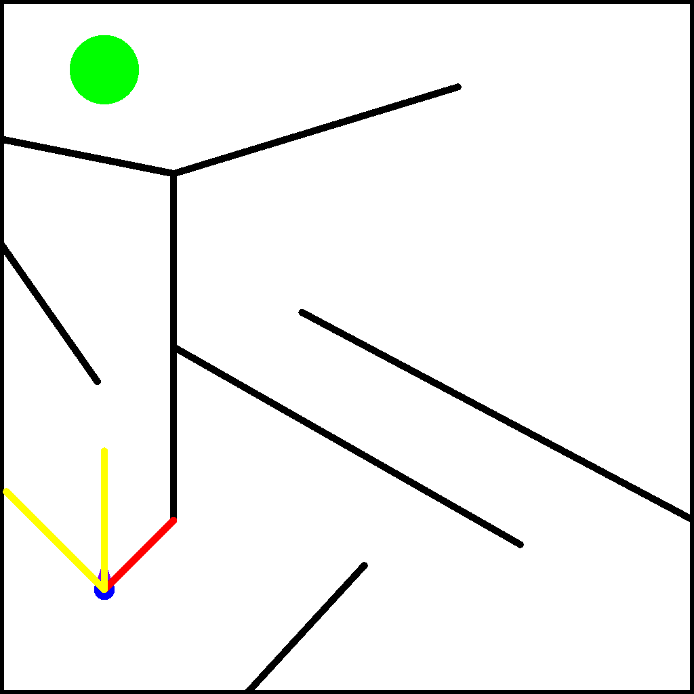
  
  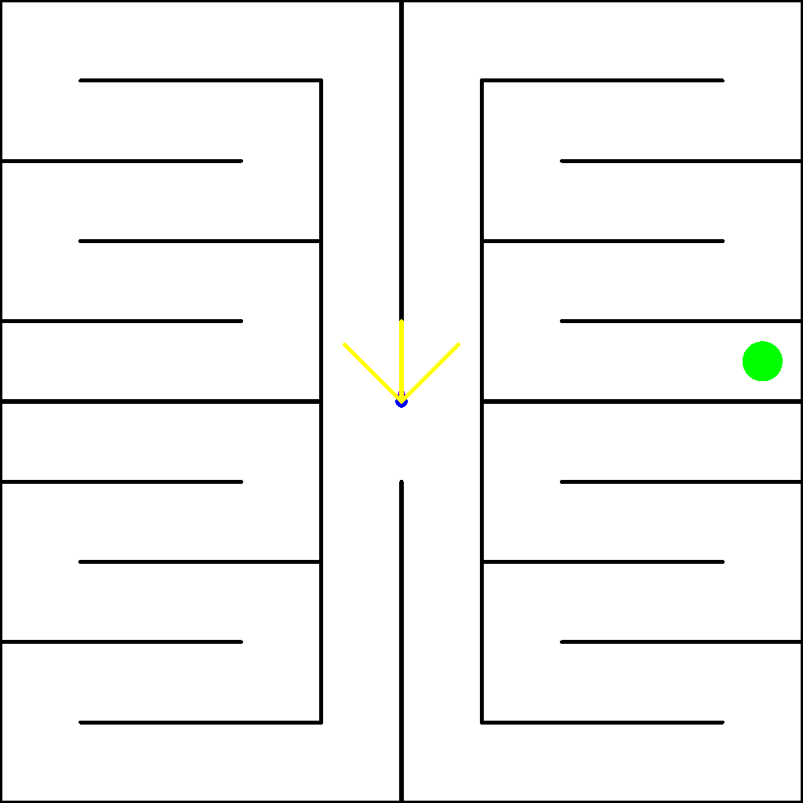
</p>

## Installation

Kheperax is available on PyPI and can be installed with:

```shell
pip install kheperax
```

Alternatively, to install Kheperax with CUDA 12 support, you can run:

```shell
pip install kheperax[cuda12]
```

## Task Properties

### Environment

Each episode is run for a fixed amount of time-steps (by default equal to `250`).
The agent corresponds to a Khepera-like robot (circular robots with 2 wheels) that moves in a planar 2-dimensional maze.
This robot has (by default):
- 3 lasers to estimate its distance to some walls in specific directions (by default -45, 0 and 45 degrees).
- 2 bumpers to detect contact with walls.
At each time-step, the agent receives an observation, which corresponds to all laser and bumper measures:
```
# by default:
[laser 1, laser 2, laser 3, bumper left, bumper right]
```
The bumpers return `1` if there's a contact with a wall and `-1` otherwise.

The actions to pass to the environment should be between `-1` and `1`.
They are then scaled depending on a scale defined in the environment configuration.

## Run examples

### Install Dependencies

Before running examples, we recommend creating a virtual environment and installing the required dependencies:

```shell
python -m venv venv
source venv/bin/activate
pip install -r requirements.txt
```

If you want to run the examples with CUDA 12 support, you need install `jax` with the `cuda12` extra:

```shell
pip install jax[cuda12]==<version-from-requirements.txt>
```

### Launch MAP-Elites Example

To run the MAP-Elites example on the standard Kheperax task, you can use the following colab notebook:

[](https://colab.research.google.com/github/adaptive-intelligent-robotics/Kheperax/blob/main/examples/main/me_training.ipynb)

Other tasks can be run with the following scripts.

```shell
python -m examples.target.target_me_training  # Target task with MAP-Elites

python -m examples.final_distance.final_distance_me_training  # Final Distance task with MAP-Elites
```

Additional details on those tasks can be found in the [Tasks and Maze Types](#tasks-and-maze-types) section.

### Rendering images and gifs

To render images, you can run the following script:
```shell
python -m examples.rendering.maps_rendering
```

To render gifs, you can run the following script:
```shell
python -m examples.rendering.gif
```

## Tasks and Maze Types

Kheperax supports various tasks and maze types. Here's an overview of the available options and their corresponding files:

### Basic Kheperax Task
- **File**: `kheperax/tasks/main.py`
- **Class**: `KheperaxTask`
- **Configuration**: `KheperaxConfig`
- **Description**: The standard Kheperax environment without a specific target.
- **Fitness**: sum of rewards
- **Reward**: negated norm of actions, r_t = -1 * norm a_t (i.e. r_t ~ negated energy spent at time t)
- **Descriptor**: final (x,y) location of the robot.

#### Key Features:

- **Reward Function**:
   - negated norm of actions, r_t = -1 * norm a_t (i.e. r_t ~ negated energy spent at time t)
   - This encourages the robot to move efficiently.
-  **Episode Termination**:
   - The episode terminates if the maximum number of steps is reached.
-  **Rendering**:
   - When rendered, the target appears as a green circle in the maze.

#### Configuration

 A `KheperaxConfig` object contains all the properties of a `KheperaxTask`:
```python

from kheperax.tasks.config import KheperaxConfig

config = KheperaxConfig.get_default()
```

Key configuration options with their default values:

- `episode_length`: `int = 250`, maximum number of timesteps per episode
- `mlp_policy_hidden_layer_sizes`: `Tuple[int, ...] = (8,)`, structure of policy network's hidden layers
- `action_scale`: `float = 0.025`, scales the actions for wheel velocities
- `robot`: `Robot`, includes:
  - `posture`: `Posture(x=0.15, y=0.15, angle=pi/2)`, initial position and orientation
  - `radius`: `float = 0.015`, robot size
  - `laser_ranges`: `Union[float, List[float]] = 0.2`, max ranges for laser sensors
  - `laser_angles`: `List[float] = [-pi/4, 0.0, pi/4]`, placement angles for laser sensors
  - `std_noise_sensor_measures`: `float = 0.0`, noise in sensor readings
- `maze`: `Maze`, defines the environment layout (default is a standard maze)
- `std_noise_wheel_velocities`: `float = 0.0`, noise in wheel velocities
- `resolution`: `Tuple[int, int] = (1024, 1024)`, rendering resolution
- `limits`: `Tuple[Tuple[float, float], Tuple[float, float]] = ((0., 0.), (1., 1.))`, environment boundaries
- `action_repeat`: `int = 1`, number of times each action is repeated

Usage example:
```python

from kheperax.tasks.config import KheperaxConfig
from kheperax.simu.robot import Robot
from kheperax.simu.maze import Maze

config = KheperaxConfig.get_default()

config.episode_length = 1000
config.action_scale = 0.03
config.resolution = (800, 800)

new_robot = Robot.create_default_robot().replace(radius=0.05)
config.robot = new_robot

new_maze = Maze.create(segments_list=[...])  # Define maze segments
config.maze = new_maze
```

### Target Kheperax Task
- **File**: `kheperax/tasks/target.py`
- **Class**: `TargetKheperaxTask`
- **Configuration**: `TargetKheperaxConfig`
- **Description**: Kheperax environment with a target position for the robot to reach.
- **Fitness**: sum of rewards (detailed below)
- **Descriptor**: final (x,y) location of the robot.

#### Key Features:

- **Reward Function**:
   - At each step, the reward is the negative distance to the target center.
   - This encourages the robot to move towards the target.
-  **Episode Termination**:
   - The episode ends when the robot reaches the target (enters the target radius).
   - Also terminates if the maximum number of steps is reached.
-  **Rendering**:
   - When rendered, the target appears as a green circle in the maze.

#### Configuration

`TargetKheperaxConfig` contains the same parameters as `KheperaxConfig`, plus additional target-related parameters:
- **Target Position**: Defines a specific point in the maze for the robot to reach. Default position: `(0.15, 0.9)`
- **Target Radius**: Specifies the size of the target area.
   - Default radius: 0.05
   - The episode ends when the robot enters this radius.

Usage example:
```python
from kheperax.tasks.target import TargetKheperaxConfig, TargetKheperaxTask

# Create a default target configuration
target_config = TargetKheperaxConfig.get_default()

# Customize the configuration if needed
target_config.target_pos = (0.2, 0.8)  # Change target position
target_config.target_radius = 0.06    # Change target radius

# Create the target task
target_task = TargetKheperaxTask(target_config)

# Use the task in your experiment
# ... (reset, step, etc.)
```

### Final Distance Kheperax Task
- **File**: `kheperax/tasks/final_distance.py`
- **Class**: `FinalDistKheperaxTask`
- **Description**: A task that only rewards the final distance to the target.
- **Fitness**: sum of rewards (detailed below)
- **Descriptor**: final (x,y) location of the robot.

#### Key Features:
- **Reward Function**:
   - At each step, the reward is -1, except for the final step, where the reward is 100 * the negative distance to the target center.
   - This encourages the robot to move towards the target as quickly as possible.
-  **Episode Termination**:
   - The episode ends when the robot reaches the target (enters the target radius).
   - Also terminates if the maximum number of steps is reached.

`TargetKheperaxConfig` is still used to manage the configuration for this kind of task (see above description)

### Maze Maps
- **File**: `kheperax/envs/maze_maps.py`
- **Description**: Defines various maze layouts, including:
  - Standard Kheperax maze - `standard`
  - Pointmaze - `pointmaze`
  - Snake maze - `snake`

To use a specific maze map:

```python

from kheperax.tasks.config import KheperaxConfig
from kheperax.tasks.target import TargetKheperaxConfig

# Get the default configuration for the desired maze map
maze_map = KheperaxConfig.get_default_for_map("standard")  # or "pointmaze", "snake"

# For target-based tasks
target_maze_map = TargetKheperaxConfig.get_default_for_map("standard")  # or "pointmaze", "snake"
```

|           |                            Standard                             |                            PointMaze                             |                            Snake                             |
|:---------:|:---------------------------------------------------------------:|:----------------------------------------------------------------:|:------------------------------------------------------------:|
| No target | 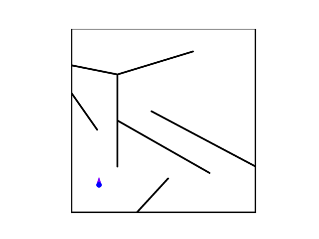 | 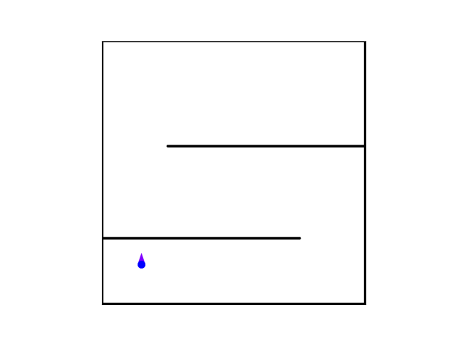 | 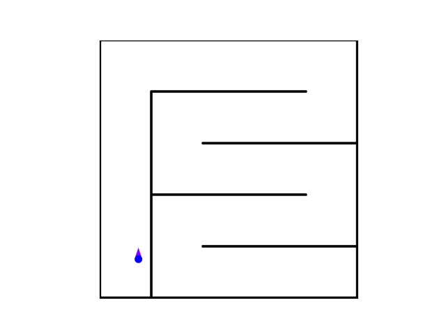 |
|  Target   |  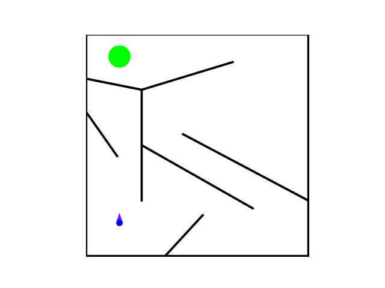   |  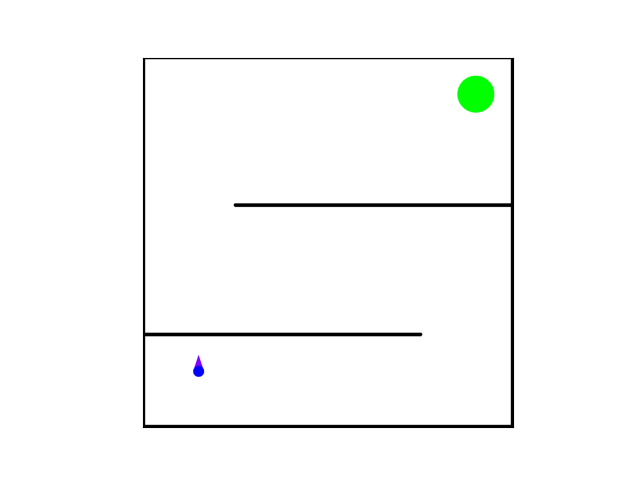   |  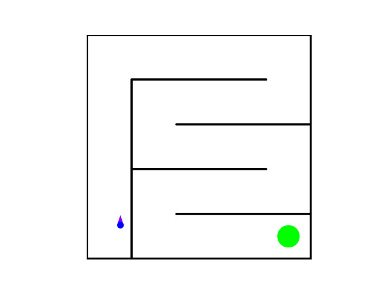   |

### Quad Mazes
- **File**: `kheperax/tasks/quad.py`
- **Function**: `make_quad_config`
- **Description**: Creates quad mazes, which are essentially four copies of the original maze flipped in different orientations.

To create a quad maze configuration:

```python

from kheperax.tasks.config import KheperaxConfig
from kheperax.tasks.target import TargetKheperaxConfig
from kheperax.tasks.quad import make_quad_config

# Get the default configuration for the desired maze map
maze_map = KheperaxConfig.get_default_for_map("standard")  # or "pointmaze", "snake"
target_maze_map = TargetKheperaxConfig.get_default_for_map("standard")  # or "pointmaze", "snake"

# Create a quad maze configuration
quad_config = make_quad_config(maze_map)  # or target_maze_map for target-based tasks
```

|           |                        Quad Standard                         |                        Quad PointMaze                         |                        Quad Snake                         |
|:---------:|:------------------------------------------------------------:|:-------------------------------------------------------------:|:---------------------------------------------------------:|
| No target | 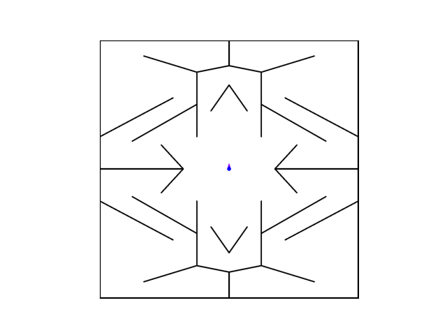 | 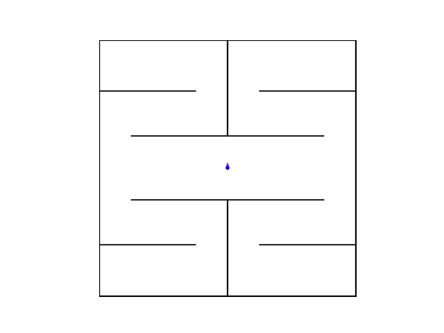 | 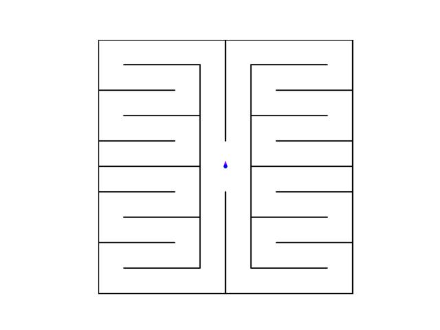 |
|  Target   |  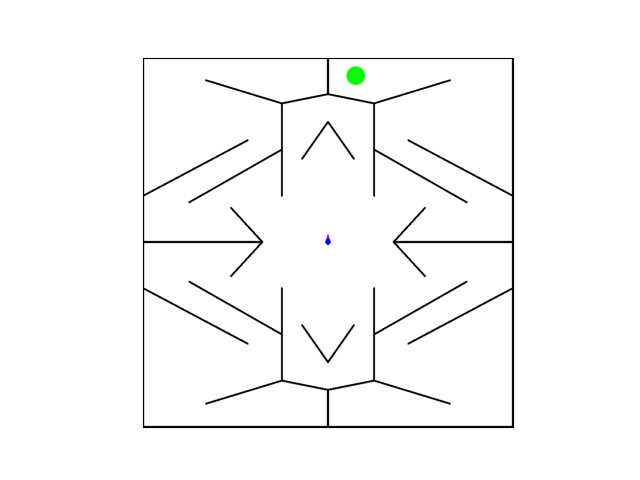   |  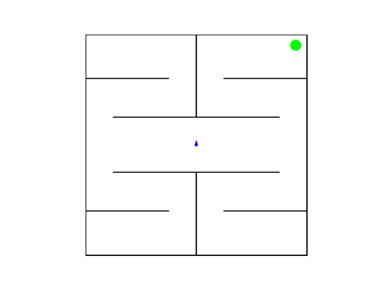   |  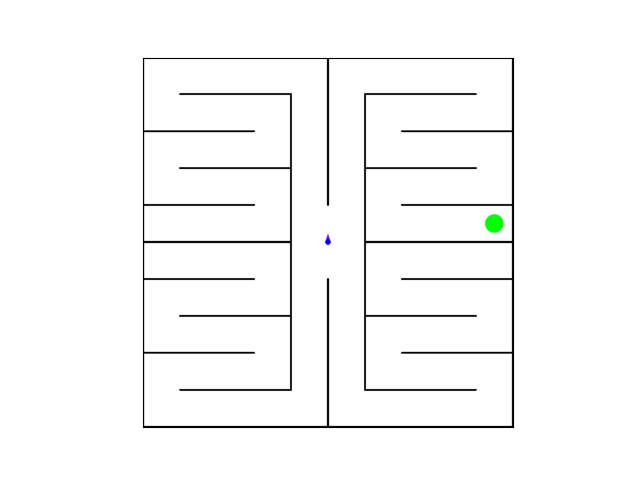   |


## Contributing

Contributions are welcome! Please feel free to submit a Pull Request.

## License

This project is licensed under the MIT License - see the LICENSE file for details.

## Citation

If you use Kheperax in your research, please cite the following paper:

```bibtex
@inproceedings{grillotti2023kheperax,
  title={Kheperax: a lightweight jax-based robot control environment for benchmarking quality-diversity algorithms},
  author={Grillotti, Luca and Cully, Antoine},
  booktitle={Proceedings of the Companion Conference on Genetic and Evolutionary Computation},
  pages={2163--2165},
  year={2023}
}
```

## Acknowledgements

- [Original `fastsim` simulator](https://github.com/sferes2/libfastsim) by Mouret and Doncieux (2012)
