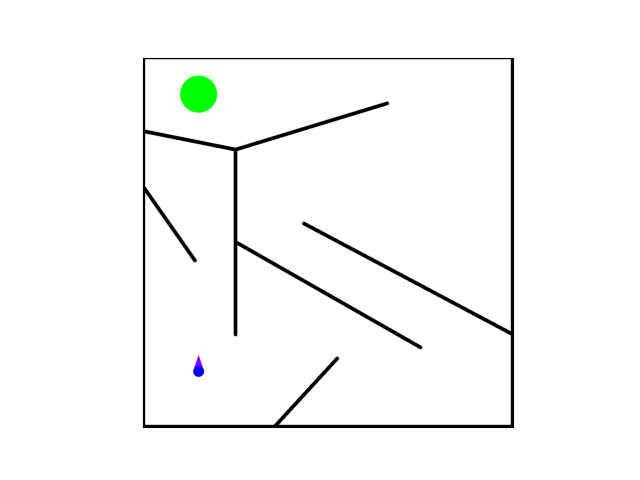

# Kheperax

The *Kheperax* task is a re-implementation of the [`fastsim` simulator](https://github.com/sferes2/libfastsim) from _Mouret and Doncieux (2012)_.
Kheperax is fully written using [JAX](https://github.com/google/jax), to leverage hardware accelerators and massive parallelization.

## Features

- Fully implemented in JAX for hardware acceleration
- Simulates Khepera-like robots (circular robots with 2 wheels) in 2D mazes
- Configurable robot sensors (lasers and bumpers)
- Supports Quality-Diversity optimization scenarios
- Customizable maze layouts and target-based tasks

## Installation

Kheperax is available on PyPI and can be installed with:

```shell
pip install kheperax
```

Alternatively, to install Kheperax with CUDA 12 support, you can run:

```shell
pip install kheperax[cuda12]
```

## Task Properties

### Environment

Each episode is run for a fixed amount of timesteps (by default equal to `250`).
The agent corresponds to a Khepera-like robot that moves in a planar 2-dimensional maze.
This robot has (by default):
- 3 lasers to estimate its distance to some walls in specific directions (by default -45, 0 and 45 degrees).
- 2 bumpers to detect contact with walls.
At each time-step, the agent receives an observation, which corresponds to all laser and bumper measures: 
```
# by default:
[laser 1, laser 2, laser 3, bumper left, bumper right]
```
The bumpers return `1` if there's a contact with a wall and `-1` otherwise.

The actions to pass to the environment should be between `-1` and `1`. 
They are then scaled depending on a scale defined in the environment configuration.

### Quality-Diversity Properties

- Fitness: sum of negated norm of actions (-1 * sum of norm a_t, ~negated energy)
- Descriptor: final 2-dimensional location of the robot.

## Run examples

### Launch MAP-Elites Example

```shell
python -m examples.me_training
```

### Test Rendering a Maze Image

```shell
python -m examples.rendering
```

### Test Rendering a GIF

```shell
python -m examples.gif
```

## Task Configuration

The `KheperaxTask` takes as input a `KheperaxConfig` object, organised as follows:

`KheperaxConfig`
- `Robot`:
  - `posture`: initial `Posture` (containing position and orientation)
  - `radius`: robot radius
  - `laser_ranges`: laser max ranges.
  - `laser_angles`: angles of placement of the lasers on the robot
  - `std_noise_sensor_measures`: standard deviation of the gaussian noise applied to the sensor measures.
  - `lasers_return_minus_one_if_out_of_range`: 
  If `True`, then the lasers return `-1` if their measure is out of range (like in the original implementation).
  If `False`, then returns the max laser range.
- `Maze`:
  - `walls`: tree of `Segments` representing the placement of the walls in the environment.
- `action_scale`: all the commanded wheel velocities will be between -1 * `action_scale` and `action_scale`
- `std_noise_wheel_velocities`: standard deviation of the gaussian noise applied to the wheel velocities.
- `resolution`: resolution of the maze when calling `env.render(...)` 
- `action_repeat`: number of times the action is repeated before the next observation is computed.

To get an initial configuration, you can run:
```python
config_kheperax = KheperaxConfig.get_default()
```

You can then modify the properties of the config by directly changing its attributes.

## Tasks and Maze Types

Kheperax supports various tasks and maze types. Here's an overview of the available options and their corresponding files:

### Basic Kheperax Task
- **File**: `kheperax/tasks/main.py`
- **Class**: `KheperaxTask`
- **Description**: The standard Kheperax environment without a specific target.

### Target Kheperax Task
- **File**: `kheperax/tasks/target.py`
- **Class**: `TargetKheperaxTask`
- **Configuration**: `TargetKheperaxConfig`
- **Description**: Kheperax environment with a target position for the robot to reach.

#### Key Features:
- **Target Position**: Defines a specific point in the maze for the robot to reach. Default position: (0.15, 0.9)
- **Target Radius**: Specifies the size of the target area.
   - Default radius: 0.05
   - The episode ends when the robot enters this radius.
- **Reward Function**: 
   - At each step, the reward is the negative distance to the target center.
   - This encourages the robot to move towards the target.
-  **Episode Termination**:
   - The episode ends when the robot reaches the target (enters the target radius).
   - Also terminates if the maximum number of steps is reached.
-  **Rendering**: 
   - When rendered, the target appears as a green circle in the maze.

#### Usage Example:
```python
from kheperax.tasks.target import TargetKheperaxConfig, TargetKheperaxTask

# Create a default target configuration
target_config = TargetKheperaxConfig.get_default()

# Customize the configuration if needed
target_config.target_pos = (0.2, 0.8)  # Change target position
target_config.target_radius = 0.06    # Change target radius

# Create the target task
target_task = TargetKheperaxTask(target_config)

# Use the task in your experiment
# ... (reset, step, etc.)
```

### Final Distance Kheperax Task
- **File**: `kheperax/tasks/final_distance.py`
- **Class**: `FinalDistKheperaxTask`
- **Description**: A task that only rewards the final distance to the target.

### Quad Mazes
- **File**: `kheperax/tasks/quad.py`
- **Function**: `make_quad_config`
- **Description**: Creates quad mazes, which are essentially four copies of the original maze flipped in different orientations.

### Maze Maps
- **File**: `kheperax/envs/maze_maps.py`
- **Description**: Defines various maze layouts, including:
  - Standard Kheperax maze - `standard`
  - Pointmaze - `pointmaze`
  - Snake maze - `snake`

To use a specific maze map:
```python
from kheperax.envs.maze_maps import get_target_maze_map

maze_map = get_target_maze_map("standard")  # or "pointmaze", "snake"
```

## Advanced Usage

### Target-based Tasks

Use `TargetKheperaxTask` for scenarios with a target position:

```python
from kheperax.tasks.target import TargetKheperaxConfig

target_config = TargetKheperaxConfig.get_default()
```

This setup includes:
- A target position (default: (0.15, 0.9))
- Target radius (default: 0.05)
- Reward based on distance to target
- Episode termination upon reaching the target

### Quad Mazes

To create a quad maze configuration:

```python
from kheperax.tasks.quad import make_quad_config
from kheperax.tasks.target import TargetKheperaxConfig

# Start with a base configuration
base_config = TargetKheperaxConfig.get_default()

# Create a quad maze configuration
quad_config = make_quad_config(base_config)
```

Quad mazes expand the original maze into four quadrants, providing a more complex environment for the robot to navigate. The `make_quad_config` function takes an existing configuration and transforms it into a quad maze configuration.

## Kheperax with a target

In order to use Kheperax with a target position to reach at the end of the maze, you can use the `TargetKheperaxTask` class. 
The target position is set by default in `(0.15, 0.9)` with a radius of `0.05`. 
The reward at each step is defined as the negative distance to the target center, and reaching the target position ends the episode.   
Rendering the environment will then show the target position as a green circle.

## Contributing

Contributions are welcome! Please feel free to submit a Pull Request.

## License

This project is licensed under the MIT License - see the LICENSE file for details.

## Citation

If you use Kheperax in your research, please cite the following paper:

```bibtex
@inproceedings{grillotti2023kheperax,
  title={Kheperax: a lightweight jax-based robot control environment for benchmarking quality-diversity algorithms},
  author={Grillotti, Luca and Cully, Antoine},
  booktitle={Proceedings of the Companion Conference on Genetic and Evolutionary Computation},
  pages={2163--2165},
  year={2023}
}
```

## Acknowledgements

- [Original `fastsim` simulator](https://github.com/sferes2/libfastsim) by Mouret and Doncieux (2012)

---



